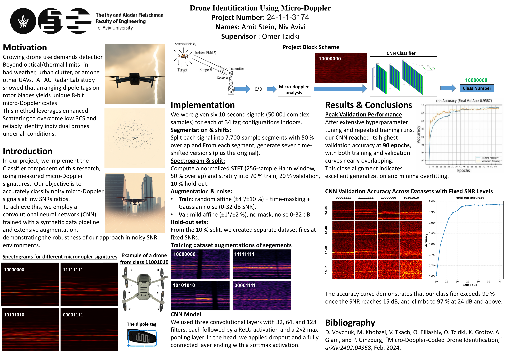

# Drone Identification Using Micro Doppler

This repository contains code to generate a synthetic dataset, train a CNN, evaluate it, and classify micro-Doppler–based drone signals.

---

## Project Poster

---

## How to Run the Code

### 1. Environment Setup

It is strongly recommended to use a fresh Conda environment for consistent results.
Python 3.10 is recommended. Newer or older versions may not be compatible with all packages.

Create and activate environment:

    conda create -n drone_env python=3.10 -y
    conda activate drone_env

(Optional) Install scientific stack via conda for performance:

    conda install numpy=1.23 scipy matplotlib scikit-learn pandas

Install all other dependencies:

    pip install -r requirements.txt

---

### 2. Create a Synthetic Dataset

From the project root, run:

    python data/create_synthetic.py --output_folder <your_dataset_name>

Example:

    python data/create_synthetic.py --output_folder simple_dataset

Output:

- Synthetic dataset saved in data/datasets/<your_dataset_name>/
  - train.npz (training data)
  - val.npz (validation data)
  - holdout_snr_<snr_values>.npz (evaluation/holdout data)

---

### 3. Train the CNN Model

#### 3.1 Start a new experiment

    python training/train.py --d_set <your_dataset_name> --epochs 20

Example:

    python training/train.py --d_set simple_dataset --epochs 6

Replace <your_dataset_name> with the folder name under data/datasets/.

Output:

- Creates experiment folder outputs/xp/<xp_id>/
  - best.h5 (best model checkpoint)
  - classes.npy (class labels)
  - results/ (training and validation logs/metrics)

#### 3.2 Continue a stopped experiment

    python training/train.py --xp <xp_id> --epochs 10

#### 3.3 Restart an experiment from scratch

Ignores previous checkpoints and starts fresh:

    python training/train.py --xp <xp_id> --epochs 10 --fresh_start

---

### 4. Evaluate the Model on the Holdout Set

Evaluate a trained model on a specific holdout dataset:

    python evaluate_test.py --xp <xp_id> --holdout_dir dataset_<your_dataset_name>

Output:

- Evaluation results stored in
  outputs/xp/<xp_id>/holdout_results/dataset_<your_dataset_name>/
  including accuracy, confusion matrix, and classification reports.

---

### 5. Plot Holdout Summary

Generate accuracy curves and example spectrograms:

    python plot_holdout_summary.py --xp <xp_id>

Or with explicit dataset, labels, and SNRs:

    python plot_holdout_summary.py --xp <xp_id> --holdout_dir dataset_<your_dataset_name> --labels 11000000 11111111 10000000 10101010 --snrs 24 20 16 10

- Replace labels and snrs with the relevant classes and SNRs for your experiment.
- If --holdout_dir and --your_dataset_name are omitted, defaults will be used.

---

### 6. Classify a New .mat File

Classify a new raw .mat file using a trained experiment:

    python classify.py <xp_id> path_to_your_file.mat

Example:

    python classify.py bbc7e8e9 data/raw_data/four_classes_hov_on/DJI_Hovering_on_Rotors_Foil_10101010__Freq_3.300__Sample_3.mat

Output:

- Prints predicted label and frequency of occurrence.

---

### 7. Command-Line Argument Summary

--xp
    Experiment identifier (auto-generated when starting a new training run).

--d_set
    Dataset folder name under data/datasets/.

--epochs
    Number of training epochs.

--fresh_start
    If provided, ignores previous checkpoints and restarts training from scratch.
